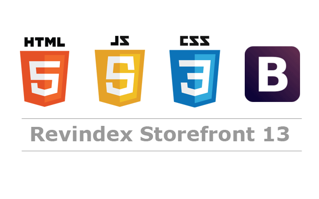

### Hey there 


<br />

Hi, I'm [MalliMuondu](https://medium.com/@mallimuondu/my-first-experience-of-coding-b8f4e2896a77), i am a young developer 🚀 from Kenya, currently, I'm a student from 🙍🏽‍♂️ [@earlycamp](https://twitter.com/earlycamp?lang=da). Beside's programming, I enjoy eating food,traveling,swimming and playing tennis.

  
  
**Things i am working on:**

- 👨🏽‍💻 I’m currently working on something cool :wink:;
- 🌱 I’m currently learning python ; 
- 💬 Ask me about anything, I am happy to help;
- 📫 How to reach me:[@Gmail](https://mail.google.com/mail/u/0/#search/Malli) [@youtube](https://www.youtube.com/channel/UCw8WbwJUOh4dntF04lUHjNg/videos?view=0&sort=dd&shelf_id=1) [@Medium](https://medium.com/@mallimuondu);
- 📝[Resume](https://github.com/mallimuondu/resume)

**Languages i am studying :**  

</code>


📊 **This Week I Spent My Time On:**
<!--START_SECTION:waka-->
```text
coding       12 hrs 00 mins   ███████████████████▓░░░░░   50.28 % 
tennis       3 hrs 00 mins   █████████████▓░░░░░   40.73 % 
swimming     1 hrs         ▒░░░░░░░░░░░░░░░░░░░░░░░░   01.91 % 
```
<!--END_SECTION:waka-->

🚧 **My Todoist Stats:**
<!-- TODO-IST:START -->
🏆  5,874 Karma Points           
🌸  Completed 2 tasks today           
🗓  Completed 4 tasks this week           
✅  Completed 120 tasks so far           
⏳  Longest streak is 7 days
<!-- TODO-IST:END -->


<details>
<summary>📈 My GitHub Stats</summary>

<p align="center"> 

</details>


